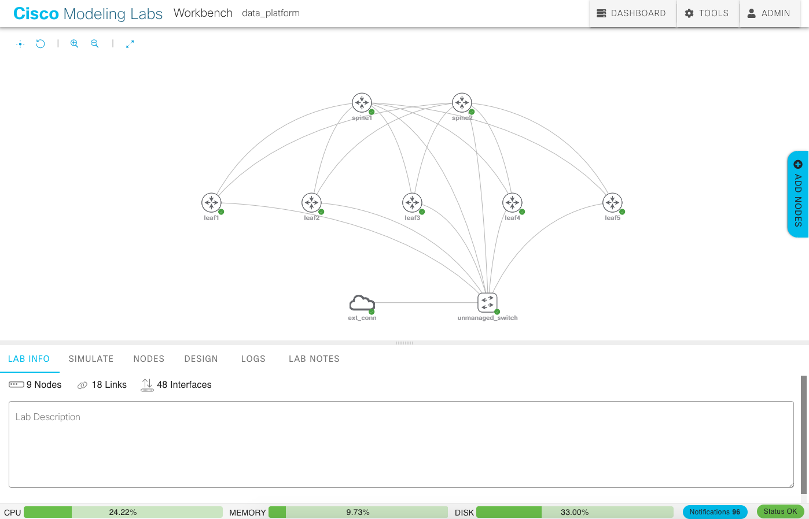

# data_platform

The goal of this project is to simulate a production network using code.

## Objectives

*  Deploy immutable network infrastucture on Cisco Modeling Labs 2.1
   using the python virl2_client library. 

*  Deploy, configure and store the network IPAM data in Netbox

*  Generate and deploy network configuration files using Ansible Roles + Netbox

*  Connect immutable servers to the topology and simulate production
   network traffic including unicast and multicast data flows.

*  Monitor data flows, resource utliisation and telemetry data, visualize
   using Kibana/Grafana.

## Method

### Infrastructure

*  1x Intel NUC Kit, part# NUC8I7BEH, 32GB RAM, 128GB M.2 NVMe 1.3 SSD, running
   ESXI 6.7.0 Update 3 and Cisco Modeling Labs 2.1 (Personal License).

*  1x Intel NUC Kit, part# DN2820FYKH, 8GB RAM, 240GB SSD, running Centos 7
   with Ansible, Netbox-docker and ELK.

## Diagram

This topology diagram will be updated as the build evolves.



## Prerequistes

This build assumes:

1. Cisco CML 2.x address is 192.168.137.252

2. Node data_controller is running Centos 7 and has python3 installed. Note,
   I spent several hours trying to run Netbox-docker on Centos 8 but postgres
   was inaccesible to the netbox container on TCP 5432, hence why I used
   Centos 7.

3. Your python/ansible source machine's public SSH key has been copied to your data controller.

4. Ensure your data_controller hostname is 'localhost', otherwise netbox docker will fail to start.

## Setting up your environment

1. On your python/ansible controller, clone this repository

2. Create a new virtualenv ```pythont3 -m venv venv```

3. Start the virtualenv ```source venv/bin/activate```

4. Install the necessary python packages ```pip install -r requirements.txt```


WORK IN PROGRESS
